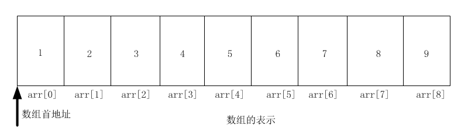

## 数组
数组是数据结构中最基础的数据结构，几乎每一种编程语言都有数组。

### 什么是数组？
所谓数组，是一组有序元素的序列，是用来存储多个相同类型数据的集合。数组会在内存中开辟一段连续的空间，并在此空间存放元素。通俗的来讲，数组就像公寓里的一排房间，每个房间都有一个编号（0,1,2,.....100），根据房间的编号，可以找到房间里的人。

数组属于线性结构。

### 数组的基本使用

- 数组的初始化
- 根据索引获取元素
- 数组的遍历
- 修改某个元素的值
- 删除指的位置的元素

[详见代码实现](./code)

### 实现数组

- 数组是否为空
- 获取数组的个数
- 获取数组的容量
- 判断数组是否已满
- 查找元素的位置
- 某个值是否在数组中存在
- 向数组首部插入新元素
- 向数组末尾插入新元素
- 插入新元素到指的位置
- 修改指的位置的元素
- 获取指定位置的元素
- 删除指的位置的元素
- ......

[详见代码实现](./code)
