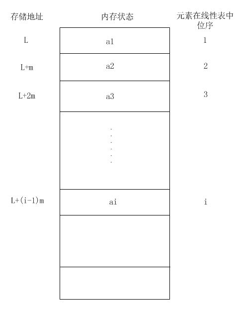
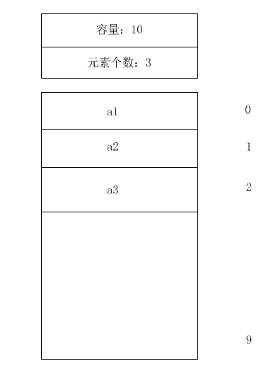
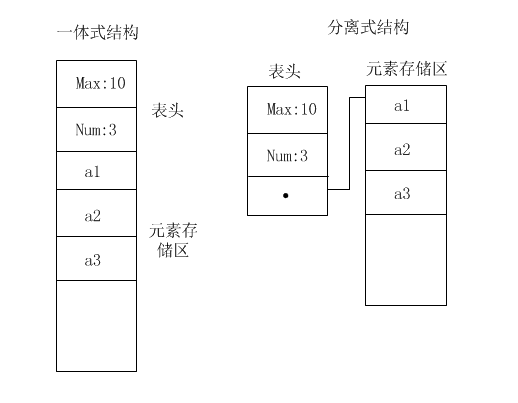

# 顺序表
顺序表即顺序存储结构实现的线性表，指的是用一组连续的存储单元依次存储线性表的数据元素，假设线性表的每个元素需要占用 m 个存储单元，第一个元素的存储位置为 L1, 则第二个数据元素的存储位置为 L1 + m, 第 i 个元素的存储为为 L1 + (i-1) * m。  

换句话说顺序表中的元素其数据间的逻辑关系和数据在计算机内存储的物理关系是一致的。只要确定了顺序表的起始位置，则线性表中的任意数据的位置都可以知道，当然也就可以直接访问（也称随机存取），所以顺序表也是一种随机存储的数据结构。

## 顺序表的结构和基本实现

### 结构
顺序表的完整信息包含两部分，一部分是为实现正确操作而需要记录的信息（表容量和元素个数），这部分称为**顺序表表头**，表头区信息主要包括元素存储区的容量和当前表中已有的元素个数，另一部分则是顺序表数据主体，即数据元素的集合。

### 实现方式

1. 一体式结构：存储表信息的单元（表头）和元素存储区以连续的方式存储在一块存储区里，两部分数据的整体形成一个顺序表的对象。一体式的结构整体性强，易于管理，但是由于数据元素存储区域是表对象的一部分，顺序表创建后，元素存储区就固定了。
2. 分离式结构：顾名思义，就是将存储表信息的单元（表头）和元素存储区分开存储，表对象里只保存与整个表有关的信息（容量和元素个数），实际的元素则存储在另一个独立的存储单元里，表对象通过链接的方式与元素存储区关联。

>> 如何替换线性表元素存储区？

一体式结构由于顺序表信息区和数据存储区连续在一起，如果想要更换数据区，只能整体替换，即对整个数据表对象改变。  

分离式结构如果想要更换数据区，只需要将表信息区的数据区地址更新到新的数据存储区地址即可，表对象不需要改变。

>> 如何扩充线性表元素存储区？

一体式的结构由于初始化之后元素存储区已经固定，若想扩充，程序只能重新申请一个线性表来存储。  

分离式结构的顺序表，如果需要将元素存储区扩充为更大的区域，则可以在不改变表对象的前提下对数据存储区进行扩充，原理和替换元素存储区一样。所以，理论上只要计算机由足够的空闲存储，这种表结构的就不会因为满了而导致操作无法进行。人们把这种技术实现的顺序表叫**动态顺序表**，因为其容量可以在使用中动态变化。

## 顺序表的基本操作

- 创建顺序表
- 添加数据元素到起始位置
- 添加数据元素到末尾位置
- 添加数据元素到任意位置
- 查找指定位置的数据元素
- 修改指定位置的数据元素
- 删除指定位置的数据元素
- 顺序表是否为空
- 顺序表是否已满
- 遍历输出数据元素
- 获取顺序表的元素个数
- 元素是否存在
- 根据值查找元素的位置
- 销毁顺序表

[详见代码实现](./code)