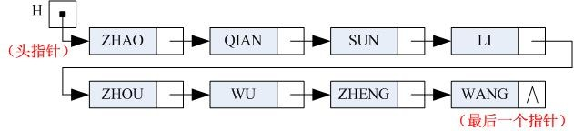
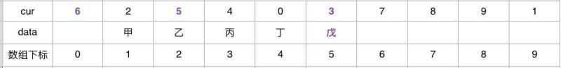

## 链表
链表,即链式存储结构实现的线性表,链表的特点是用一组任意的存储单元存储线性表的数据元素.这组存储单元可以是连续的,也可以是不连续的.

### 节点
为了表示每个数据元素 Ai 与其直接后继元素的 Ai+1 之间的逻辑关系, 对数据 Ai 来说,除了存储其本身的信息之外,还需要存储一个指示其直接后继的信息(即直接后继的存储位置).这两部分组成数据元素的存储映像,称为节点.它包括两个域:

- 数据域: 用来存储数据元素信息
- 指针域: 用来存储直接后继存储位置(指针或链)

n 个节点链结成一个链表.

### 单向链表
链表的每个结点中只包含一个指针域,称为线性链表或单向链表

一般情况下,我们在单链表的第一个结点之前附设一个结点,称之为 **头结点**.头结点的数据域可以不存储任何信息,也可以存储如线性表的长度等类的附加信息,头结点的指针域指向第一个结点的指针(即第一个结点的存储位置)

[详见代码实现](./code)

### 静态链表

对于不设"指针"类型的高级程序设计语言, 例如: php, python 等, 在实现单向链表的数据结构时, 往往是采用数组来描述线性链表.其中,数组的一个分量表示一个结点, 元素的位置(游标)代替指针指示结点在数组中的相对位置.数组的第 0 分量可看成头结点.这样的存储结构仍需要预先分配比较大的存储空间, 但在插入和删除时不需要移动元素, 仅需要修改指针.仍具有链式存储结构的主要优点.

[详见代码实现](./code)