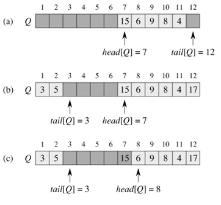
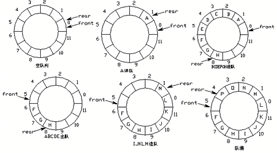

# 循环队列
和顺序栈类似,在队列的顺序存储结构中,除了用一组地址连续的存储单元依次存放从队头到对尾的元素之外,还需要附设两个指针 front 和 rear 分别指向队列头元素及队尾元素.

## 顺序队列的问题:

假设当前队列分配的最大空间为 6, 则当队列处于 (d) 的状态时不可再继续插入新的队尾元素,否则会因为数组越界而遭到程序代码被破坏.然而此时又不宜如顺序栈那样,进行存储再分配扩大数组空间,因为队列的实际可用空间并未占满
一个巧妙的办法就是将顺序队列臆造为一个环状的空间,即循环队列

## 循环队列

[详见代码实现](./code)