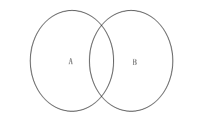
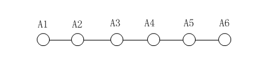
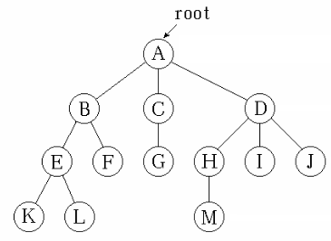
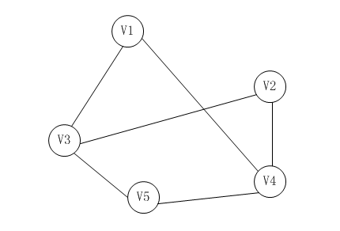

# 数据结构
数据结构是指相互之间存在一种或多种特定关系的数据元素的集合，是计算机用来存储和组织数据的方式。数据元素都不是孤立存在的，而是在它们之间存在着某种关系，这种数据元素相互之间的关系称为结构。

## 数据结构分类
根据数据元素间关系的不同特性，将数据结构常分为下列四类基本的结构：

### 1. 集合结构
数据结构中的元素之间除了 “同属一个集合” 的相互关系外，别无其他关系；所谓集合就是我们中学学过的集合的概念：
若x是集合A的元素，则记作 x 属于 A。集合中的元素有三个特征：

1. 确定性（集合中的元素必须是确定的）
2. 互异性（集合中的元素必须是互不相同的，没有重复的元素）
3. 无序性（集合中的元素没有先后之分）

集合结构之间的元素是极其松散的。

### 2. 线性结构
线性结构的特点是：

1. 存在唯一的一个被称作“第一个”的数据元素
2. 存在唯一的一个被称作“最后一个”的数据元素
3. 除第一个元素之外，集合中的每一个数据元素均只有一个前驱
4. 除最后一个元素之外，集合中每一个数据元素均只有一个后继

常用的线性结构有：线性表，栈，队列，双队列，数组，串。

线性结构中的元素存在一对一的相互关系。

### 3. 树形结构
树形结构是一层次的嵌套结构。一个树形结构的外层和内层有相似的结构，所以这种结构多可以递归的表示。经典数据结构中的各种树状图是一种典型的树形结构：一颗树可以简单的表示为根，左子树，右子树。左子树和右子树又有自己的子树。

树形结构的数据元素之间存在着一对多的关系。

### 4. 图结构
图形结构，简称 “图”，是一种复杂的数据结构。图形结构中，每个结点的前驱结点数和后续结点数可以任意多个。

图结构的元素之间存在着多对多的关系。

## 物理结构
数据结构在计算机中的表示称为数据的物理结构, 又称为存储结构.数据元素在计算机中有两种不同的存储结构：

### 1. 顺序存储结构
顺序数据结构是指把数据元素放在地址连续的存储单元里，其数据间的逻辑关系和物理关系是一致的。顺序表的存储空间需要预先分配。  

优点：  
1. 存储密度大（＝1），存储空间利用率高。
2. 不用为表示节点间的逻辑关系而增加额外的存储开销。
3. 顺序表具有按元素序号随机访问的特点。

缺点：  
1. 在顺序表中做插入、删除操作时，平均移动表中的一半元素，因此对 n 较大的顺序表效率低。
2. 需要预先分配足够大的存储空间，估计过大，可能会导致顺序表后部大量闲置；预先分配过小，又会造成溢出。

### 2. 链式存储结构
链式存储结构是指数据元素放在任意的存储单元中，存储单元可以是连续的，也可以是不连续的。  

优点：  
1. 比顺序存储结构的存储密度小（< 1）。
2. 逻辑上相邻的节点物理上不必相邻。
3. 插入、删除灵活 (不必移动节点，只要改变节点中的指针)。

缺点：  
1. 链式存储结构中每个结点都由数据域与指针域两部分组成，相比顺序存储结构增加了存储空间。
2. 查找结点时链式存储要比顺序存储慢。
2. 需要预先分配足够大的存储空间，估计过大，可能会导致顺序表后部大量闲置；预先分配过小，又会造成溢出。

## 数据结构的实现

### 线性结构

- [数组](./Array/README.md)
- [线性表](./LinearList/README.md)
    - [顺序表](./LinearList/SequenceList.md)
    - [单向链表](./LinearList/SinglyLinkedList.md)
    - [双向链表](./LinearList/DoublyLinkedList.md)
    - [循环链表](./LinearList/LoopLinkedList.md)
- [栈](./Stack/README.md)
    - [顺序栈](./Stack/SequenceStack.md)
    - [链栈](./Stack/LinkedStack.md)
- [队列](./Queue/README.md)
    - [循环队列](./Queue/LoopQueue.md)
    - [链队列](./Queue/LinkedQueue.md)
- [串](./String/README.md)
    - [定长顺序存储](./String/SequenceString.md)
    - [堆分配存储](./String/HeapString.md)
    - [块链存储](./LinkedString.md)

### 树结构

- [树](./tree/README.md)
- [二叉树](./tree/BinaryTree.md)
    - [遍历二叉树](./tree/TraverBinaryTree.md)
- [森林]
- [赫夫曼树]
    
- [红黑树]

### 图结构