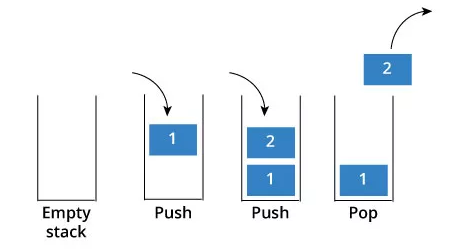

# 栈
栈是一种 “后进先出” (Last In First Out, 简称 LIFO ) 的数据结构，何谓后进先出？按照生活中常见的场景来形容栈就是对盘子，你洗完第一个盘子一定是在底部（在栈中就是 Push 入栈），最后一个盘子是在顶部，当你想使用盘子的的时候，一定是从最顶部拿走（在栈中就是 Pop 出栈）。

栈是一种线性数据结构，且仅能在线性表的一端操作，栈顶允许操作，栈底不允许操作。

## 栈操作

栈的基本操作包括：

- 创建栈
- 销毁栈
- 清空栈
- 判读是否为空栈
- 出栈
- 入栈
- 获取栈顶元素
- 获取栈的大小
- 遍历栈

[详见代码实现](./code)