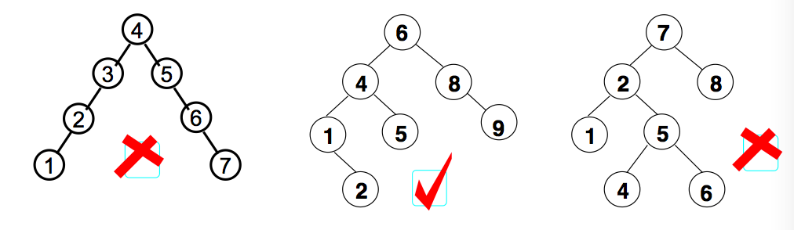

# 平衡二叉树
之前我们介绍了二叉查找树（Binary Search Tree），对于大多数情况下的查找和插入的效率来说是没有问题的，在最差的情况下效率比较低，要实现在最差的情况下也能达到 lgN 的效率，就要保证树在插完之后始终保持平衡状态。即平衡二叉树。  
平衡二叉树（Balanced Binary Tree）是二叉查找树的一个进化体，也是第一个引入平衡概念的二叉树。1962年，G.M. Adelson-Velsky 和 E.M. Landis发明了这棵树，所以它又叫 AVL 树。

## 定义

平衡二叉树要求对于每一个节点来说，它的左右子树的高度之差不能超过1，如果插入或者删除一个节点使得高度之差大于1，就要进行节点之间的旋转，将二叉树重新维持在一个平衡状态。

## 原理
现在有 a[10] = {3, 2, 1, 4, 5, 6, 7, 10, 9, 8}需要构建二叉排序树。在没有学习平衡二叉树之前，根据二叉排序树的特性，通常会将它构建成如下左图。虽然完全符合二叉排序树的定义，但是对这样高度达到8的二叉树来说，查找是非常不利的。因此，更加期望构建出如下右图的样子，高度为4的二叉排序树，这样才可以提供高效的查找效率。

>> 平衡二叉树是一种二叉排序树，是一种高度平衡的二叉树，其中每个结点的左子树和右子树的高度至多等于 1 意味着：
要么是一棵空树，要么左右都是平衡二叉树，且左子树和右子树深度之绝对值不超过1. 将二叉树上结点的左子树深度减去右子树深度的值称为平衡因子BF，
那么平衡二叉树上的所有结点的平衡因子只可能是 -1、0 和 1。只要二叉树上有一个结点的平衡因子的绝对值大于 1，则该二叉树就是不平衡的。

## 结点插入

### 插入
根据二叉平衡树的定义，一定保持左右子树深度绝对值小于1. 在平衡二叉树插入工作一定考虑深度差，在 AVL 树进行插入工作时候，困难在于可能破坏 AVL 树的平衡属性

### 旋转问题
对于一个平衡的节点，由于任意节点最多有两个儿子，因此高度不平衡时，此节点的两颗子树的高度差2.容易看出，这种不平衡出现在下面四种情况：

1. 6节点的左子树3节点高度比右子树7节点大2，左子树3节点的左子树1节点高度大于右子树4节点，这种情况成为左左。
2. 6节点的左子树2节点高度比右子树7节点大2，左子树2节点的左子树1节点高度小于右子树4节点，这种情况成为左右。
3. 2节点的左子树1节点高度比右子树5节点小2，右子树5节点的左子树3节点高度大于右子树6节点，这种情况成为右左。
4. 2节点的左子树1节点高度比右子树4节点小2，右子树4节点的左子树3节点高度小于右子树6节点，这种情况成为右右。

从图2中可以可以看出，1 和 4 两种情况是对称的，这两种情况的旋转算法是一致的，只需要经过一次旋转就可以达到目标，我们称之为单旋转。2和3两种情况也是对称的，这两种情况的旋转算法也是一致的，需要进行两次旋转，我们称之为双旋转。

### 旋转操作

#### 单旋转
单旋转是针对于左左和右右这两种情况的解决方案，这两种情况是对称的，只要解决了左左这种情况，右右就很好办了。图3是左左情况的解决方案，节点k2不满足平衡特性，因为它的左子树k1比右子树Z深2层，而且k1子树中，更深的一层的是k1的左子树X子树，所以属于左左情况。

为使树恢复平衡，我们把 k1 变成这棵树的根节点，因为 k2 大于 k1，把 k2 置于 k1 的右子树上，而原本在 k1 右子树的 Y 大于 k1，小于 k2，就把 Y 置于 k2 的左子树上，这样既满足了二叉查找树的性质，又满足了平衡二叉树的性质。

#### 双旋转
对于左右和右左这两种情况，单旋转不能使它达到一个平衡状态，要经过两次旋转。双旋转是针对于这两种情况的解决方案，同样的，这样两种情况也是对称的，只要解决了左右这种情况，右左就很好办了。图4是左右情况的解决方案，节点k3不满足平衡特性，因为它的左子树k1比右子树Z深2层，而且k1子树中，更深的一层的是k1的右子树k2子树，所以属于左右情况。

为使树恢复平衡，我们需要进行两步，第一步，把k1作为根，进行一次左旋转，旋转之后就变成了左左情况，所以第二步再进行一次右旋转，最后得到了一棵以k2为根的平衡二叉树树。

[详见代码实现](./code)

## 参考
- [浅谈数据结构-平衡二叉树](http://www.cnblogs.com/polly333/p/4798944.html)