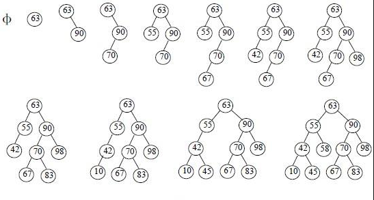

# 二叉查找树
二叉查找树（Binary Search Tree），也称有序二叉树（ordered binary tree）, 排序二叉树（sorted binary tree）。  

之前我们了解了链表和顺序表，链表在插入的时候具有较高的灵活性，而顺序表在查找时具有较高的效率。而二叉查找树(Binary Search Tree，BST)这一数据结构综合了以上两种数据结构的优点。

## 定义

二叉查找树（Binary Search Tree），也称有序二叉树（ordered binary tree）, 排序二叉树（sorted binary tree），是指一棵空树或者具有下列性质的二叉树：

1. 若任意节点的左子树不空，则左子树上所有结点的值均小于它的根结点的值
2. 若任意节点的右子树不空，则右子树上所有结点的值均大于它的根结点的值
3. 任意节点的左、右子树也分别为二叉查找树
4. 没有键值相等的节点（no duplicate nodes）

如下图所示是一个从空树开始建立的二叉查找树的过程：

## 实现

- 构建一个空树
- 添加一个节点
- 搜索元素并返回节点
- 更新节点数据
- 删除一个节点
- 获取最大的结点值
- 获取最小的结点值
- 获取二叉搜索树深度
- 判断是否是空的二叉搜索树

删除操作比较复杂，总共有三种情况：  

1. 被删除的节点是叶子节点，这时候只要把这个节点删除，再把指向这个节点的父节点指针置为空就行
2. 被删除的节点有左子树，或者有右子树，而且只有其中一个，那么只要把当前删除节点的父节点指向被删除节点的左子树或者右子树就行。
3. 被删除的节点既有左子树而且又有右子树，这时候需要把**左子树的最右边的节点或者右子树最左边的节点提到被删除节点的位置**，为什么要这样呢，根据二叉查找树的性质，父节点的指针一定比所有左子树的节点值大而且比右子树的节点的值小，为了删除父节点不破坏二叉查找树的平衡性，应当把**左子树最大的节点**或者 **右子树最小的节点** 放在父节点的位置，这样的话才能维护二叉查找树的平衡性。

[详见代码实现](../code)

## 参考
- [二叉查找树](http://www.cnblogs.com/yangecnu/p/Introduce-Binary-Search-Tree.html)