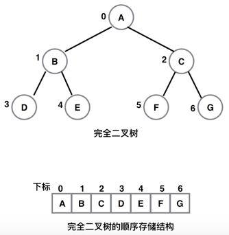
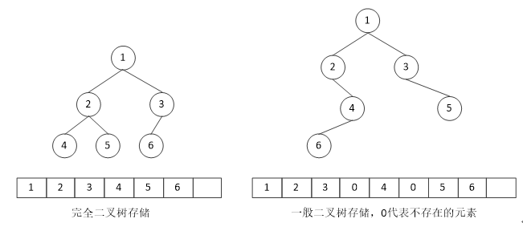
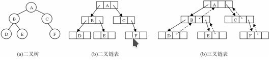

# 二叉树
二叉树是另一种树型结构,它的特点是每个结点至多只有两颗子树(即二叉树中不存在度大于2的结点), 并且二叉树的子树有左右之分,其次序不能任意颠倒, 二叉树是一种有序树

## 二叉树特点

1. 在二叉树的第 i 层上至多有 2 的 (i-1) 次方个结点
2. 深度为 k 的二叉树至多有 2 的 k 次方 -1 个结点
3. 对任何一颗二叉树 T, 如果其终端结点树为 n0, 度为 2 的结点树为 n2, 则 n0 = n2 + 1
4. 具有 n 个结点的完全二叉树的深度为 log2N + 1

## 二叉树的存储结构

### 顺序存储结构
用一组地址连续的存储单元依次自上而下.自左至右存储完全二叉树的结点元素,这种顺序存储结构仅适用于完全二叉树

### 链式存储结构

二叉树的结点由一个数据元素和分别指向其左右子树的两个分支构成,则表示二叉树的链表中的结点至少包含 3 个域: 数据域和左,右指针域.有时为了方便找到结点的双亲,则还可以在结点结构中增加一个指向其双亲结点的指针域.利用这种结构所得二叉树
的存储结构分别称为二叉链表和三叉链表

## 二叉链表操作

- 构造一个二叉链表
- 先序遍历二叉链表
- 中序遍历二叉链表
- 后序遍历二叉链表
- 层序遍历二叉链表