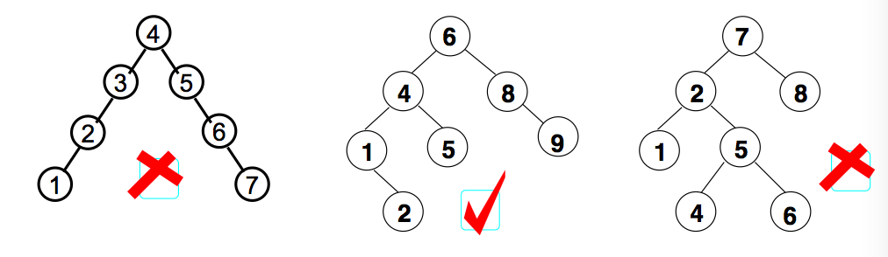
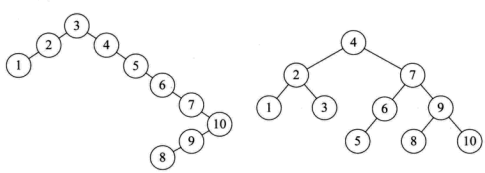

# 平衡二叉树
之前我们介绍了二叉查找树（Binary Search Tree），对于大多数情况下的查找和插入的效率来说是没有问题的，在最差的情况下效率比较低，要实现在最差的情况下也能达到 lgN 的效率，就要保证树在插完之后始终保持平衡状态。即平衡二叉树。  
平衡二叉树（Balanced Binary Tree）是二叉查找树的一个进化体，也是第一个引入平衡概念的二叉树。1962年，G.M. Adelson-Velsky 和 E.M. Landis发明了这棵树，所以它又叫 AVL 树。

## 定义

平衡二叉树要求对于每一个节点来说，它的左右子树的高度之差不能超过1，如果插入或者删除一个节点使得高度之差大于1，就要进行节点之间的旋转，将二叉树重新维持在一个平衡状态。

## 原理
现在有 a[10] = {3, 2, 1, 4, 5, 6, 7, 10, 9, 8}需要构建二叉排序树。在没有学习平衡二叉树之前，根据二叉排序树的特性，通常会将它构建成如下左图。虽然完全符合二叉排序树的定义，但是对这样高度达到8的二叉树来说，查找是非常不利的。因此，更加期望构建出如下右图的样子，高度为4的二叉排序树，这样才可以提供高效的查找效率。

>> 平衡二叉树是一种二叉排序树，是一种高度平衡的二叉树，其中每个结点的左子树和右子树的高度至多等于1.意味着：
要么是一棵空树，要么左右都是平衡二叉树，且左子树和右子树深度之绝对值不超过1. 将二叉树上结点的左子树深度减去右子树深度的值称为平衡因子BF，那么平衡二叉树上的所有结点的平衡因子只可能是-1、0和1。只要二叉树上有一个结点的平衡因子的绝对值大于1，则该二叉树就是不平衡的。

## 结点插入

### 插入

### 旋转

[详见代码实现](./code)

## 参考
- [浅谈数据结构-平衡二叉树](http://www.cnblogs.com/polly333/p/4798944.html)