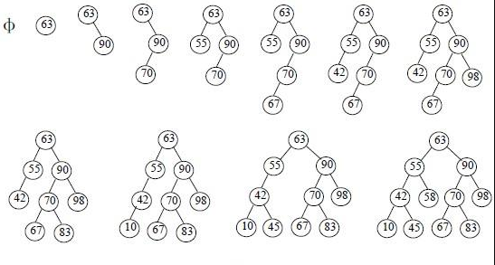

# 二叉查找树
二叉查找树（Binary Search Tree），也称有序二叉树（ordered binary tree）, 排序二叉树（sorted binary tree）。  

之前我们了解了链表和顺序表，链表在插入的时候具有较高的灵活性，而顺序表在查找时具有较高的效率。而二叉查找树(Binary Search Tree，BST)这一数据结构综合了以上两种数据结构的优点。

## 定义

二叉查找树（Binary Search Tree），也称有序二叉树（ordered binary tree）, 排序二叉树（sorted binary tree），是指一棵空树或者具有下列性质的二叉树：

1. 若任意节点的左子树不空，则左子树上所有结点的值均小于它的根结点的值
2. 若任意节点的右子树不空，则右子树上所有结点的值均大于它的根结点的值
3. 任意节点的左、右子树也分别为二叉查找树
4. 没有键值相等的节点（no duplicate nodes）

如下图所示是一个从空树开始建立的二叉查找树的过程：

## 实现

- 构建一个空树
- 添加一个节点
- 查找节点
- 更新节点数据
- 删除一个节点

[详见代码实现](../code)

## 参考
- [二叉查找树](http://www.cnblogs.com/yangecnu/p/Introduce-Binary-Search-Tree.html)